# Compte Rendu — Activité Pratique N°2
## Architecture Microservices avec Spring Cloud

**Filière :** BDCC III  
**Module :** Architecture des Systèmes Distribués et Middleware  
**Encadrant :** Pr. Mohamed YOUSSFI  
**Réalisé par :** Siham TAYEBI  
**Date :** Octobre 2026

---

## Table des matières

1. [Introduction — Architecture Microservices](#1-introduction--architecture-microservices)
2. [Microservice 1 — Customer Service](#2-microservice-1--customer-service)
3. [Microservice 2 — Inventory Service](#3-microservice-2--inventory-service)
4. [Microservice 3 — Gateway Service (routage statique)](#4-microservice-3--gateway-service-routage-statique)
5. [Microservice 4 — Discovery Service Eureka](#5-microservice-4--discovery-service-eureka)
6. [Configuration dynamique des routes de la Gateway](#6-configuration-dynamique-des-routes-de-la-gateway)
7. [Microservice 5 — Billing Service avec OpenFeign](#7-microservice-5--billing-service-avec-openfeign)
8. [Résilience — Circuit Breaker Resilience4j](#8-résilience--circuit-breaker-resilience4j)
9. [Microservice 6 — Config Service Spring Cloud Config](#9-microservice-6--config-service-spring-cloud-config)
10. [Refresh à chaud de la configuration](#10-refresh-à-chaud-de-la-configuration)
11. [Résultat final — Tous les services dans Eureka](#11-résultat-final--tous-les-services-dans-eureka)
12. [Conclusion](#12-conclusion)

---

## 1. Introduction — Architecture Microservices

### 1.1 Pourquoi les microservices ?

Les microservices permettent de réduire la complexité des systèmes en les décomposant en services indépendants, chacun développable, déployable et scalable séparément, avec des technologies différentes si nécessaire.

### 1.2 Composants de base d'une architecture microservices

| Composant | Rôle |
|---|---|
| **Gateway** | Point d'entrée unique. Reçoit toutes les requêtes et les route vers le bon microservice. Joue aussi le rôle d'équilibreur de charge |
| **Discovery Service** | Registre des microservices. Chaque service s'y enregistre avec son nom et son URL au démarrage. Quand un service est cherché, l'adresse est récupérée depuis ce registre |
| **Config Service** | Centralise les fichiers de configuration de tous les microservices. En cas de modification, tous les services reçoivent la nouvelle configuration |

### 1.3 Modes de communication entre microservices

| Mode | Protocoles / Outils | Usage |
|---|---|---|
| **Synchrone** | REST, GraphQL, gRPC, SOAP, **MCP** (dernière version pour les agents IA) | Réponse immédiate attendue |
| **Asynchrone** | **Kafka**, RabbitMQ, ActiveMQ (brokers) | Échange de messages sans attente entre services |
| **Sécurité** | OAuth2, OIDC → outil le plus utilisé en entreprise : **Keycloak** | Authentification et autorisation |

### 1.4 Flux de traitement d'une requête dans l'architecture

```
Client
  │
  ▼
┌──────────────────────┐
│    Gateway Service   │  ← Point d'entrée unique (port 8888)
└──────────┬───────────┘
           │ 1. Cherche le nom du service
           ▼
┌──────────────────────┐
│  Discovery Service   │  ← Registre Eureka (port 8761)
│      (Eureka)        │     retourne l'URL du service
└──────────┬───────────┘
           │ 2. Route + équilibre la charge entre les instances
           ▼
┌──────────────────────┐   ┌──────────────────────┐   ┌──────────────────────┐
│  Customer Service    │   │  Inventory Service   │   │  Billing Service     │
│    (port 8081)       │   │    (port 8082)       │   │    (port 8083)       │
└──────────────────────┘   └──────────────────────┘   └──────────────────────┘
```

**Scalabilité horizontale :** Si un service est surchargé, on démarre plusieurs instances sur différentes machines. La Gateway récupère la liste des instances depuis le Discovery et répartit la charge entre elles (load balancing).

Chaque microservice au démarrage **s'enregistre** dans le Discovery avec son nom et son URL. Quand la Gateway en a besoin, elle **récupère l'adresse** depuis le Discovery.

### 1.5 Application développée dans ce TP

On va développer une application de gestion de factures basée sur **6 microservices** :

```
ebank-ms/
├── customer-service/    ← port 8081  (gestion des clients)
├── inventory-service/   ← port 8082  (gestion des produits)
├── billing-service/     ← port 8083  (gestion des factures)
├── gateway-service/     ← port 8888  (point d'entrée + routage)
├── discovery-service/   ← port 8761  (registre Eureka)
└── config-service/      ← port 9999  (configuration centralisée)
```

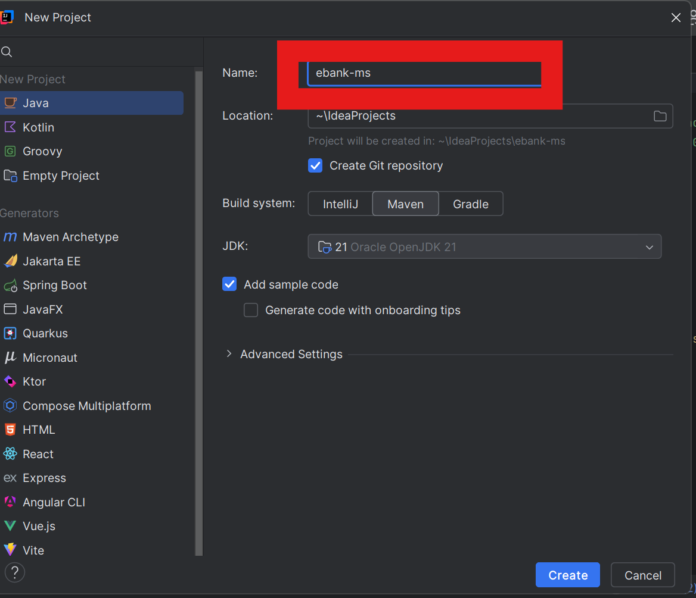

---

## 2. Microservice 1 — Customer Service

### 2.1 Création du module

On ajoute un nouveau module Spring Boot `customer-service` au projet parent :

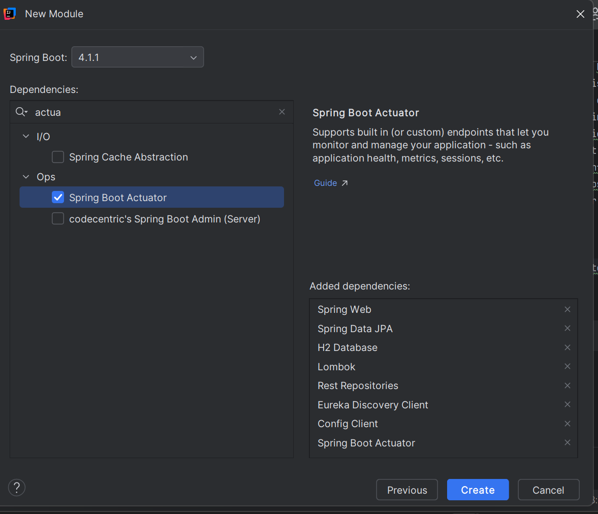

Les dépendances Maven manquantes peuvent être ajoutées manuellement dans la liste Maven :

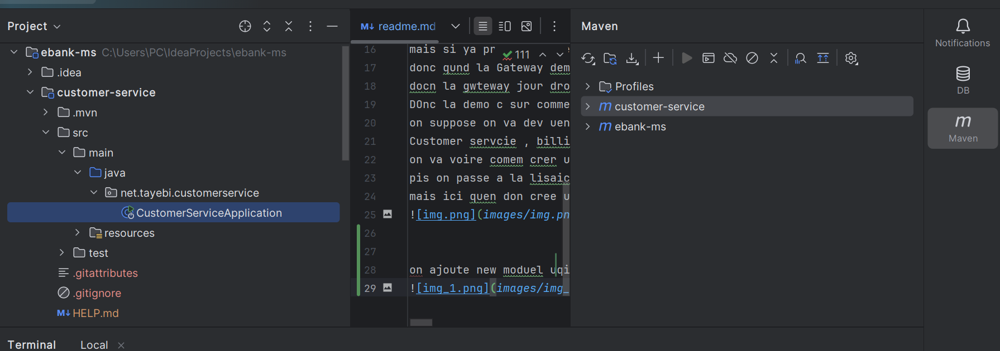

### 2.2 Entité JPA Customer

```java
package net.tayebi.customerservice.entities;

import jakarta.persistence.Entity;
import jakarta.persistence.GeneratedValue;
import jakarta.persistence.Id;
import lombok.*;

@Entity
@Getter @Setter @NoArgsConstructor @AllArgsConstructor @Builder
public class Customer {
    @Id @GeneratedValue
    private Long id;
    private String name;
    private String email;
}
```

### 2.3 Repository avec Spring Data REST

On utilise `@RepositoryRestResource` pour démarrer automatiquement un web service RESTful complet (GET, POST, PUT, DELETE) sans écrire de contrôleur :

```java
package net.tayebi.customerservice.repositories;

import net.tayebi.customerservice.entities.Customer;
import org.springframework.data.jpa.repository.JpaRepository;
import org.springframework.data.rest.core.annotation.RepositoryRestResource;

// Démarre automatiquement le web service RESTful pour accéder à toutes les méthodes de gestion des clients
@RepositoryRestResource
public interface CustomerRepository extends JpaRepository<Customer, Long> {
}
```

> **Remarque :** Spring Data REST (`@RepositoryRestResource`) est utilisé ici pour aller vite. Dans une application réelle, il faut respecter les normes et passer par une couche service avec des règles métier.

### 2.4 Alimentation de la base via CommandLineRunner

Ce bean s'exécute **automatiquement au démarrage** de l'application et insère des données de test :

```java
package net.tayebi.customerservice;

import net.tayebi.customerservice.entities.Customer;
import net.tayebi.customerservice.repositories.CustomerRepository;
import org.springframework.boot.CommandLineRunner;
import org.springframework.boot.SpringApplication;
import org.springframework.boot.autoconfigure.SpringBootApplication;
import org.springframework.context.annotation.Bean;

@SpringBootApplication
public class CustomerServiceApplication {

    public static void main(String[] args) {
        SpringApplication.run(CustomerServiceApplication.class, args);
    }

    @Bean
    CommandLineRunner start(CustomerRepository customerRepository) {
        return args -> {
            customerRepository.save(Customer.builder().name("siham").email("siham@gmail.com").build());
            customerRepository.save(Customer.builder().name("imane").email("imane@gmail.com").build());
            customerRepository.save(Customer.builder().name("fouzia").email("fouzia@gmail.com").build());
            customerRepository.save(Customer.builder().name("hamid").email("hamid@gmail.com").build());
        };
    }
}
```

### 2.5 Configuration (application.properties)

```properties
spring.application.name=customer-service
server.port=8081
spring.datasource.url=jdbc:h2:mem:customers-db
spring.h2.console.enabled=true

# Désactivé pour l'instant — chaque microservice doit se connecter au Discovery
# pour enregistrer son nom et son URL, mais on n'a qu'un seul service pour le moment
spring.cloud.config.enabled=false
spring.cloud.discovery.enabled=false
```

### 2.6 Tests

**Vérification en base H2 :**

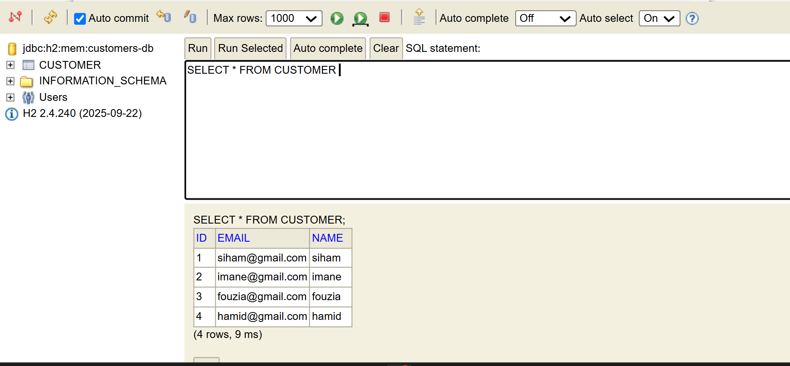

**Test du web service REST :**

```
GET http://localhost:8081/customers
```

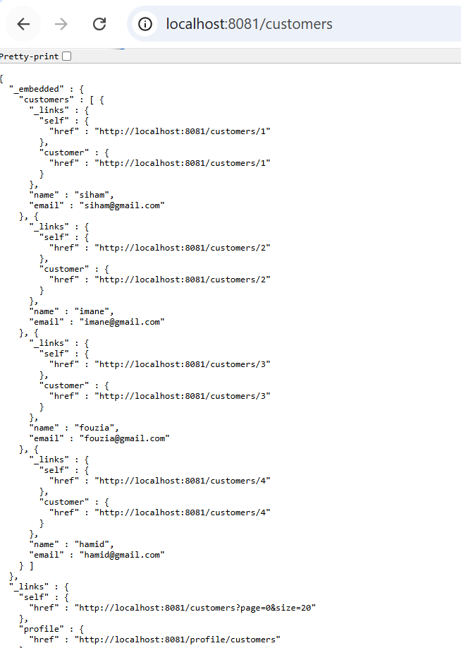

```
GET http://localhost:8081/customers/1
```

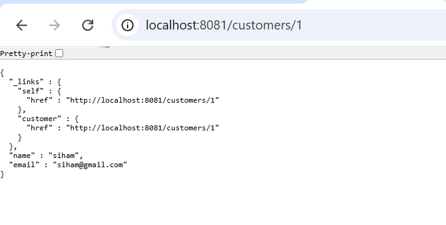

> Spring Data REST retourne les données en format HATEOAS (avec des `_links` vers les autres ressources).

---

## 3. Microservice 2 — Inventory Service

### 3.1 Dépendances du module

On crée le module `inventory-service` avec les mêmes dépendances que `customer-service`, auxquelles on ajoute :

| Dépendance | Rôle |
|---|---|
| **Rest Repositories** | Démarre les web services RESTful automatiquement |
| **Eureka Discovery Client** | Permet au service de s'enregistrer dans Eureka au démarrage |
| **Spring Config Client** | Pour contacter le service de configuration centralisée et récupérer la config |
| **Spring Actuator** | Monitoring du microservice (état, mémoire, classes chargées, cache…) |

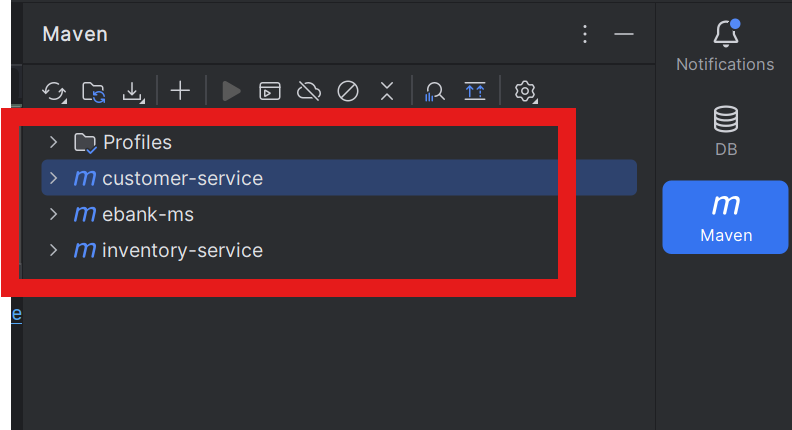

### 3.2 Entité JPA Product

```java
package net.tayebi.inventoryservice.entities;

import jakarta.persistence.Entity;
import jakarta.persistence.GeneratedValue;
import jakarta.persistence.Id;
import lombok.*;

@Entity
@Data @Builder @NoArgsConstructor @AllArgsConstructor
public class Product {
    @Id @GeneratedValue
    private Long id;
    private String name;
    private double price;
    private int quantity;
}
```

### 3.3 Repository

```java
package net.tayebi.inventoryservice;

import net.tayebi.inventoryservice.entities.Product;
import org.springframework.data.jpa.repository.JpaRepository;
import org.springframework.data.rest.core.annotation.RepositoryRestResource;

@RepositoryRestResource
public interface ProductRepository extends JpaRepository<Product, Long> {
}
```

### 3.4 CommandLineRunner — Données de test

```java
package net.tayebi.inventoryservice;

import net.tayebi.inventoryservice.entities.Product;
import org.springframework.boot.CommandLineRunner;
import org.springframework.boot.SpringApplication;
import org.springframework.boot.autoconfigure.SpringBootApplication;
import org.springframework.context.annotation.Bean;

@SpringBootApplication
public class InventoryServiceApplication {

    public static void main(String[] args) {
        SpringApplication.run(InventoryServiceApplication.class, args);
    }

    @Bean
    CommandLineRunner start(ProductRepository productRepository) {
        return args -> {
            productRepository.save(Product.builder().name("Computer").price(8000).quantity(12).build());
            productRepository.save(Product.builder().name("Printer").price(3000).quantity(5).build());
            productRepository.save(Product.builder().name("Smartphone").price(10000).quantity(10).build());
            productRepository.save(Product.builder().name("Mouse").price(100).quantity(30).build());
        };
    }
}
```

### 3.5 Configuration

```properties
spring.application.name=inventory-service
server.port=8082
spring.datasource.url=jdbc:h2:mem:products-db
spring.h2.console.enabled=true

spring.cloud.discovery.enabled=false
spring.cloud.config.enabled=false
```

### 3.6 Tests

```
GET http://localhost:8082/products
```

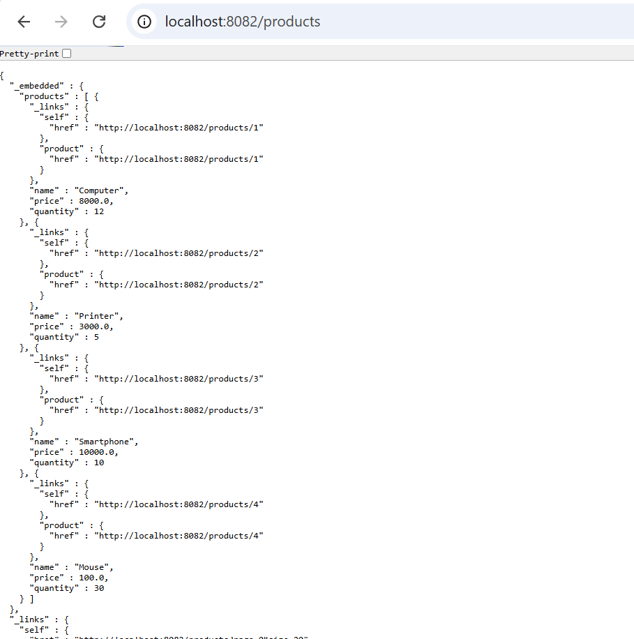

**Console H2 :**

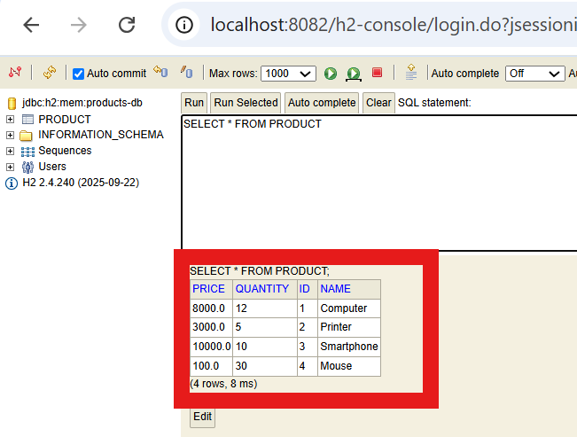

```
GET http://localhost:8082/products/1
```

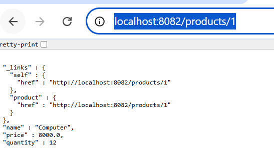

### 3.7 Spring Actuator — Monitoring du microservice

Spring Actuator expose des endpoints de monitoring. Les orchestrateurs comme **Kubernetes** ou **Docker** les utilisent pour surveiller l'état des services. Si un service ne répond plus, Kubernetes le redémarre automatiquement.

```
GET http://localhost:8082/actuator
```

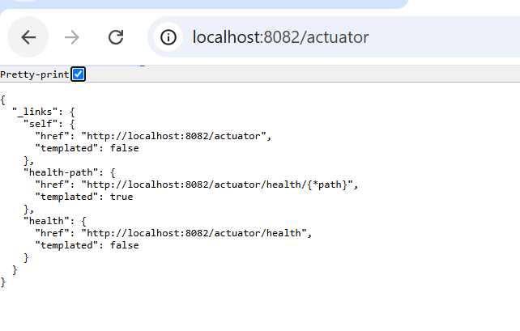

```
GET http://localhost:8082/actuator/health
```

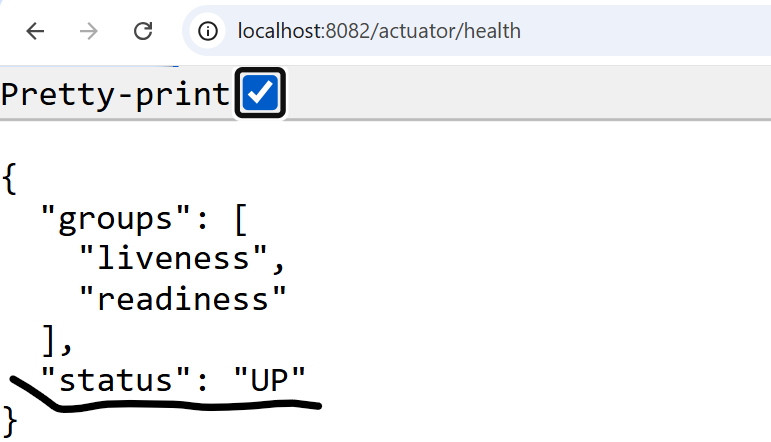

Pour exposer **tous** les endpoints Actuator, on ajoute dans `application.properties` :

```properties
management.endpoints.web.exposure.include=*
```

```
GET http://localhost:8082/actuator
```

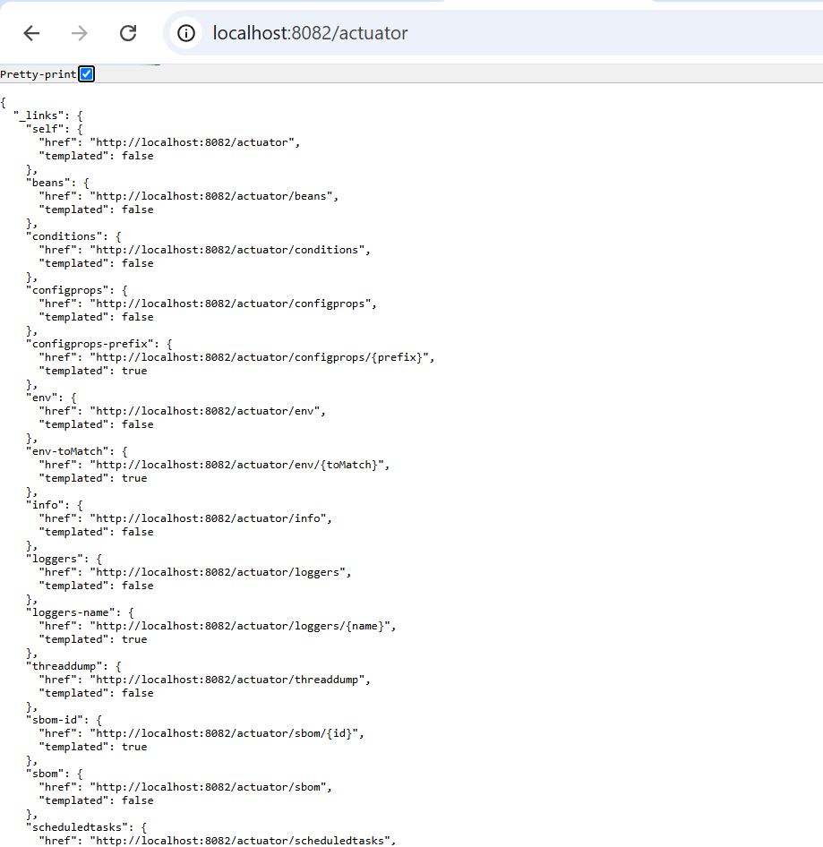

```
GET http://localhost:8082/actuator/beans
```

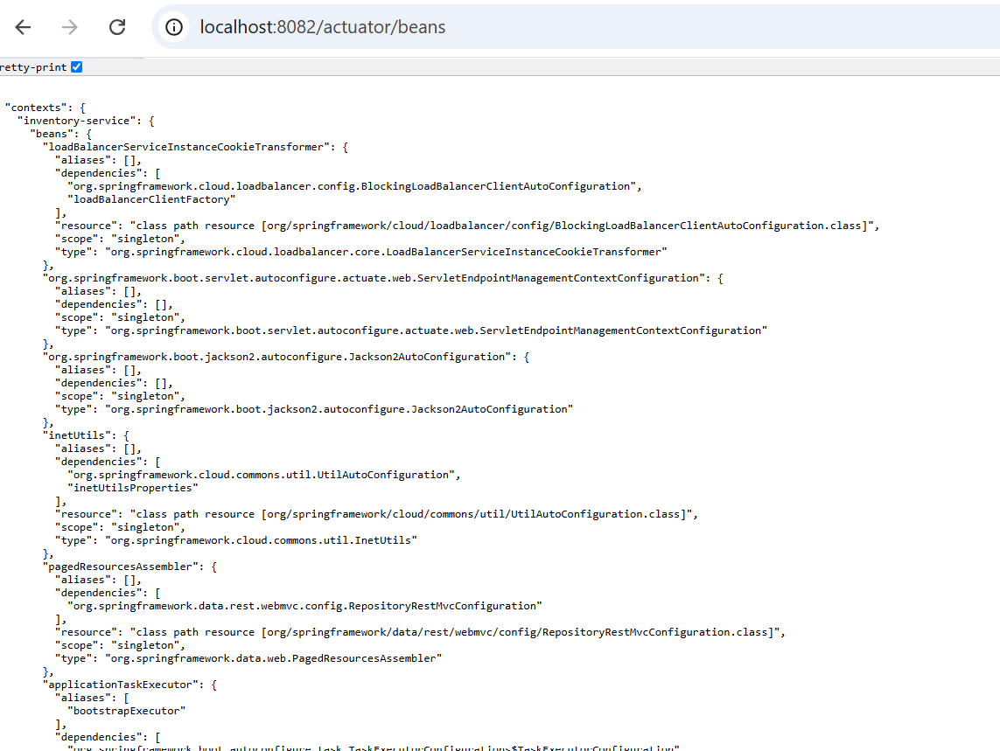

On peut aussi consulter les variables d'environnement via `/env`, le cache, les traces, etc.

> **En production**, il est recommandé de n'exposer que les endpoints nécessaires :
> ```properties
> management.endpoints.web.exposure.include=health,refresh
> ```
> `health` est le plus important : Kubernetes envoie une requête toutes les secondes vers `/actuator/health`. Si le service répond `UP`, tout va bien. Sinon, Kubernetes le redémarre. `refresh` sera utile pour la mise à jour à chaud de la configuration.

---

## 4. Microservice 3 — Gateway Service (routage statique)

### 4.1 Rôle de la Gateway

La Gateway est le **point d'entrée unique** de toute l'architecture. Elle joue deux rôles :
1. **Système de routage** : dirige chaque requête vers le bon microservice
2. **Équilibreur de charge** : répartit les requêtes entre plusieurs instances d'un même service

On crée le module `gateway-service` avec les dépendances :
- **Reactive Gateway** — pour bénéficier des Virtual Threads et du modèle non-bloquant
- **Eureka Discovery Client**
- **Spring Actuator**

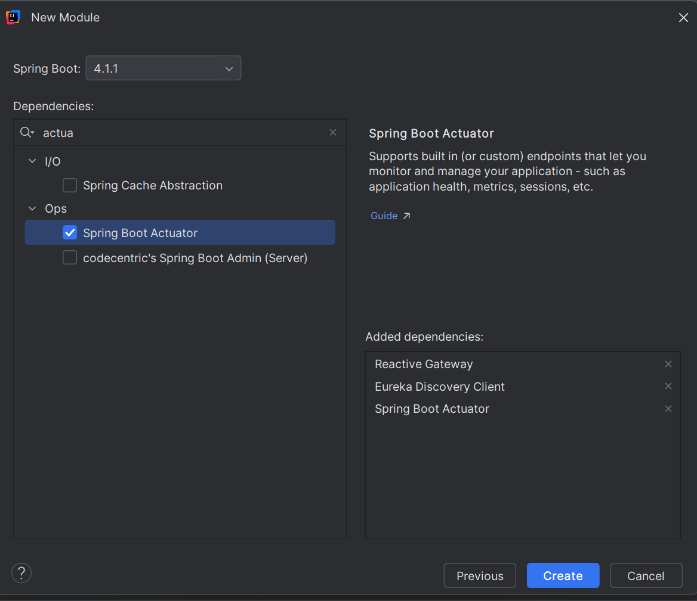

### 4.2 Configuration des routes (version statique — application.yaml)

Spring Boot peut être configuré via `.properties` **ou** `.yaml`. Le format YAML est préféré pour les configurations complexes car il est plus lisible et compatible avec Docker, Ansible, Kubernetes.

**Concepts importants :**

| Terme YAML | Signification |
|---|---|
| `id` | Identifiant unique de la route |
| `uri` | URL cible vers laquelle envoyer la requête |
| `predicates` | Conditions à satisfaire pour déclencher cette route |
| `Path` | Prédicat le plus courant : filtre par chemin de l'URL |
| `filters` | Transformations appliquées avant d'envoyer la requête (ajout de headers, token…) |

**Fichier `application.yaml` de la Gateway :**

```yaml
spring:
  application:
    name: gateway-service
  cloud:
    gateway:
      server:
        webflux:
          routes:
            - id: r1
              uri: http://localhost:8081     # URL directe (statique) du customer-service
              predicates:
                - Path=/customers/**         # Toute requête /customers/... → port 8081
            - id: r2
              uri: http://localhost:8082     # URL directe (statique) de l'inventory-service
              predicates:
                - Path=/products/**          # Toute requête /products/... → port 8082

server:
  port: 8888

spring:
  cloud:
    discovery:
      enabled: false
```

### 4.3 Tests du routage via la Gateway

**Vérification de l'état de la Gateway :**

```
GET http://localhost:8888/actuator/health  →  UP ✅
```

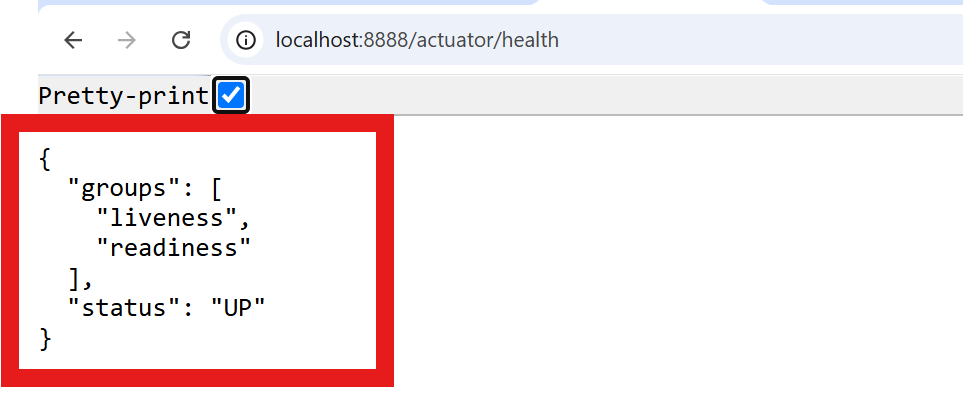

**Via la Gateway → Customer Service :**

```
GET http://localhost:8888/customers
```

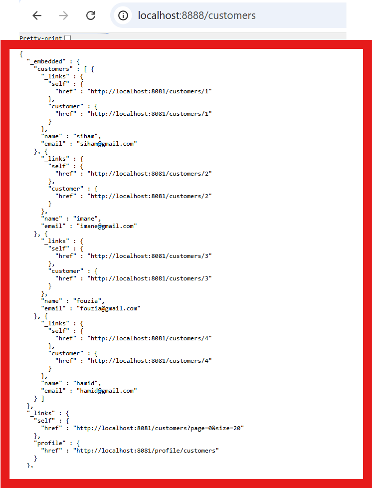

```
GET http://localhost:8888/customers/1
```

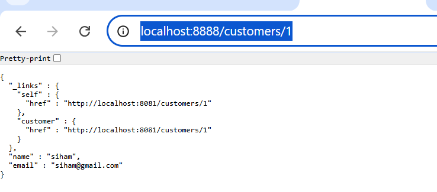

**Via la Gateway → Inventory Service :**

```
GET http://localhost:8888/products
```

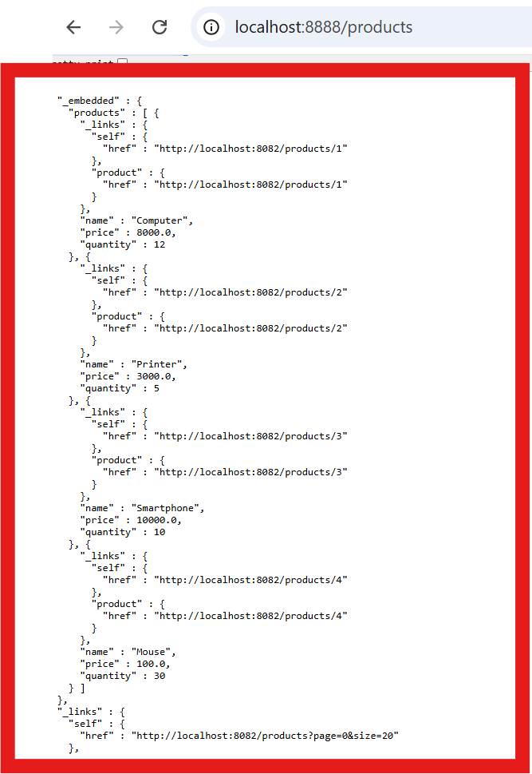

> **Principe :** Le client ne connaît que l'adresse de la Gateway (`localhost:8888`). Il ne sait pas où se trouvent les microservices. C'est la Gateway qui gère tout le routage de manière transparente.

---

## 5. Microservice 4 — Discovery Service Eureka

### 5.1 Pourquoi un Discovery Service ?

En routage statique, les adresses IP sont codées en dur dans la configuration. Ce n'est pas viable en production car :
- Les adresses IP changent quand on redémarre les conteneurs Docker
- On ne peut pas faire de scalabilité horizontale dynamique

Le **Discovery Service Eureka** résout ce problème : chaque microservice **s'y enregistre automatiquement** au démarrage avec son nom et son URL. La Gateway interroge Eureka pour obtenir les adresses dynamiquement.

> **Eureka** est développé par Netflix, l'un des premiers à avoir implémenté l'architecture microservices à grande échelle. Il est connu pour sa haute disponibilité. Il existe aussi **Consul** comme alternative.

### 5.2 Création du module

On ajoute `discovery-service` avec les dépendances :
- **Eureka Server**
- **Spring Actuator**

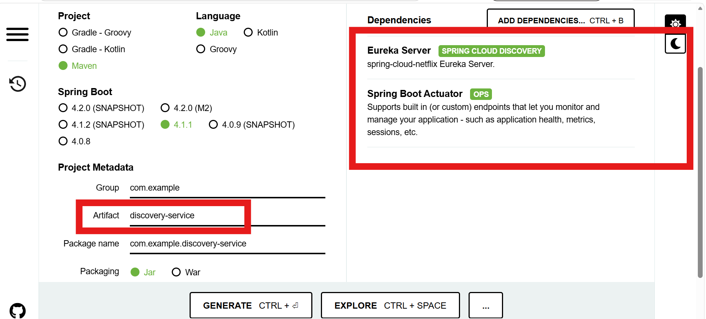

### 5.3 Activation du serveur Eureka

```java
package com.example.discovery_service;

import org.springframework.boot.SpringApplication;
import org.springframework.boot.autoconfigure.SpringBootApplication;
import org.springframework.cloud.netflix.eureka.server.EnableEurekaServer;

@SpringBootApplication
@EnableEurekaServer   // ← Active le serveur de registre Eureka
public class DiscoveryServiceApplication {
    public static void main(String[] args) {
        SpringApplication.run(DiscoveryServiceApplication.class, args);
    }
}
```

### 5.4 Configuration

```properties
spring.application.name=discovery-service
server.port=8761

# Désactiver l'auto-enregistrement du Discovery lui-même
# (il n'a pas besoin de se découvrir lui-même)
# Si on a plusieurs instances de Discovery qui communiquent entre elles,
# on peut activer ces deux options
eureka.client.fetch-registry=false
eureka.client.register-with-eureka=false
```

### 5.5 Interface Eureka — Avant enregistrement

Au premier démarrage, aucun service n'est encore enregistré car l'option discovery était désactivée dans les autres services :

```
http://localhost:8761/
```

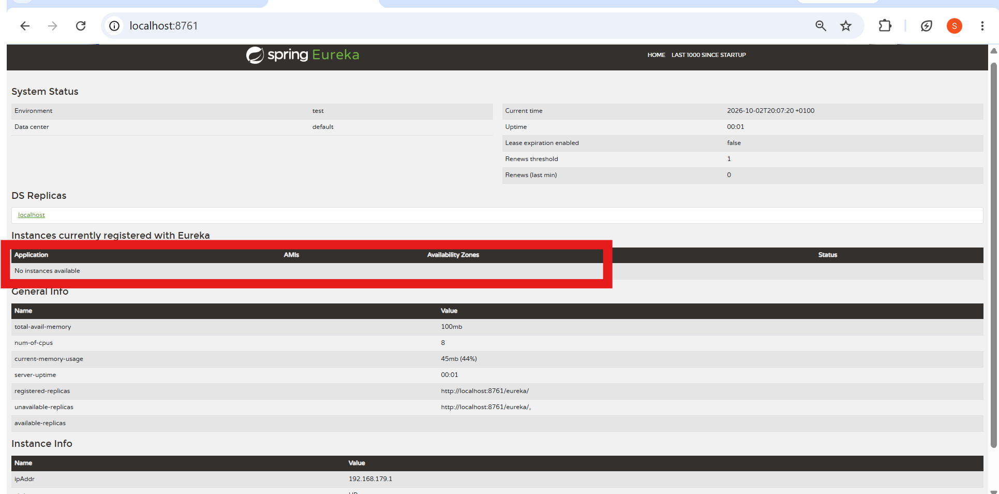

### 5.6 Activation de l'enregistrement dans tous les microservices

Dans chaque microservice (`customer-service`, `inventory-service`, `gateway-service`), on change :

```properties
# Avant
spring.cloud.discovery.enabled=false

# Après
spring.cloud.discovery.enabled=true
```

Après redémarrage de tous les services, ils apparaissent dans Eureka :

```
http://localhost:8761/
```

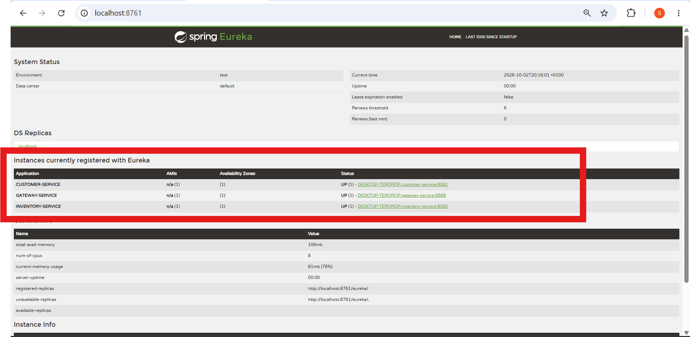

---

## 6. Configuration dynamique des routes de la Gateway

### 6.1 Passage du routage statique au dynamique

Maintenant qu'Eureka connaît les adresses de tous les services, on remplace les URL fixes par des **noms logiques** dans la configuration de la Gateway.

Le préfixe **`lb://`** (Load Balancer) indique à la Gateway de :
1. Demander l'adresse du service à Eureka
2. Activer l'équilibrage de charge entre les instances disponibles

La Gateway joue ainsi **deux rôles** : routage ET équilibrage de charge.

**Fichier `application.yaml` de la Gateway mis à jour :**

```yaml
spring:
  cloud:
    gateway:
      server:
        webflux:
          routes:
            - id: r1
              # uri: http://localhost:8081     ← Ancienne URL statique (commentée)
              uri: lb://CUSTOMER-SERVICE        # ← Nom Eureka + load balancing
              predicates:
                - Path=/customers/**
            - id: r2
              # uri: http://localhost:8082     ← Ancienne URL statique (commentée)
              uri: lb://INVENTORY-SERVICE       # ← Nom Eureka + load balancing
              predicates:
                - Path=/products/**
```

**Ce qui se passe maintenant :**

```
Client → GET /products
  ↓
Gateway reçoit la requête
  ↓
Gateway voit : Path=/products/** → route r2
  ↓
Gateway demande à Eureka : "où est INVENTORY-SERVICE ?"
  ↓
Eureka retourne la liste des instances disponibles
  ↓
Gateway choisit une instance (load balancing) et envoie la requête
  ↓
Réponse retournée au client
```

> **Note DevOps :** Pour démarrer, arrêter ou redémarrer tous les services en même temps, on utilisera **Docker** avec `docker-compose up` / `docker-compose down`. C'est l'approche DevOps pour éviter de tout faire manuellement.

### 6.2 Tests du routage dynamique

```
GET http://localhost:8888/products
```


```
GET http://localhost:8888/products/1
```

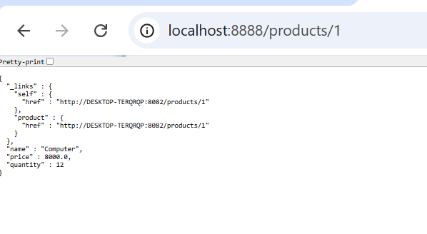

```
GET http://localhost:8888/customers
```


```
GET http://localhost:8888/customers/1
```


### 6.3 Alternative : Configuration des routes via Java Bean

Au lieu du fichier YAML, on peut configurer les routes directement en code Java via un bean de type `RouteLocator` dans la classe principale :

```java
package net.tayebi.gatewayservice;

import org.springframework.boot.SpringApplication;
import org.springframework.boot.autoconfigure.SpringBootApplication;
import org.springframework.cloud.gateway.route.RouteLocator;
import org.springframework.cloud.gateway.route.builder.RouteLocatorBuilder;
import org.springframework.context.annotation.Bean;

@SpringBootApplication
public class GatewayServiceApplication {

    public static void main(String[] args) {
        SpringApplication.run(GatewayServiceApplication.class, args);
    }

    // Alternative au fichier YAML : configuration des routes via code Java
    @Bean
    public RouteLocator routes(RouteLocatorBuilder builder) {
        return builder.routes()
                .route("r1", p -> p.path("/customers/**").uri("lb://CUSTOMER-SERVICE"))
                .route("r2", p -> p.path("/products/**").uri("lb://INVENTORY-SERVICE"))
                .build();
    }
}
```

> **Note :** On peut aussi faire la configuration dans `application.properties` mais c'est difficile à lire avec beaucoup de code. Le YAML est plus lisible.

On renomme le fichier `.yaml` pour tester que la configuration Java fonctionne seule :

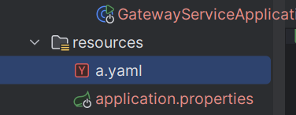

**Problème rencontré :** Avec le chemin `/**`, l'accès par ID retournait une erreur :

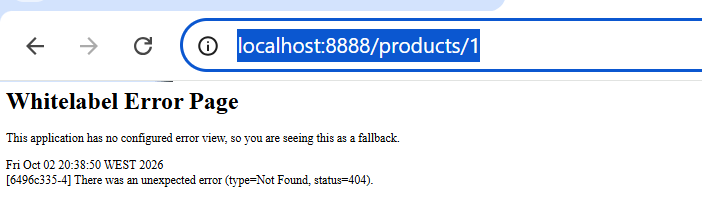

**Solution :** Utiliser `/customers/**` et `/products/**` — le `**` (double étoile) couvre bien `/customers`, `/customers/1`, `/customers/1/orders`, etc. Après correction, tout fonctionne.

```
GET http://localhost:8888/customers/1  → ✅
GET http://localhost:8888/products/1   → ✅
```


### 6.4 Routage 100% dynamique via DiscoveryClientRouteDefinitionLocator

Pour un routage entièrement automatique (sans déclarer les routes manuellement), on utilise un bean `DiscoveryClientRouteDefinitionLocator` qui crée des routes pour **tous les services enregistrés dans Eureka** :

```java
@Bean
public DiscoveryClientRouteDefinitionLocator dynamicRoutes(
        ReactiveDiscoveryClient rdc,
        DiscoveryLocatorProperties dlp) {
    return new DiscoveryClientRouteDefinitionLocator(rdc, dlp);
}
```

Les routes deviennent accessibles avec le **nom du service en majuscules** comme préfixe :

```
GET http://localhost:8888/INVENTORY-SERVICE/products
GET http://localhost:8888/INVENTORY-SERVICE/products/1
GET http://localhost:8888/CUSTOMER-SERVICE/customers
GET http://localhost:8888/CUSTOMER-SERVICE/customers/1
```

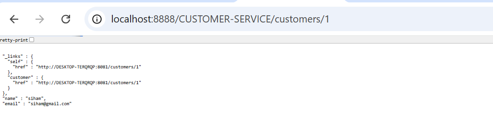


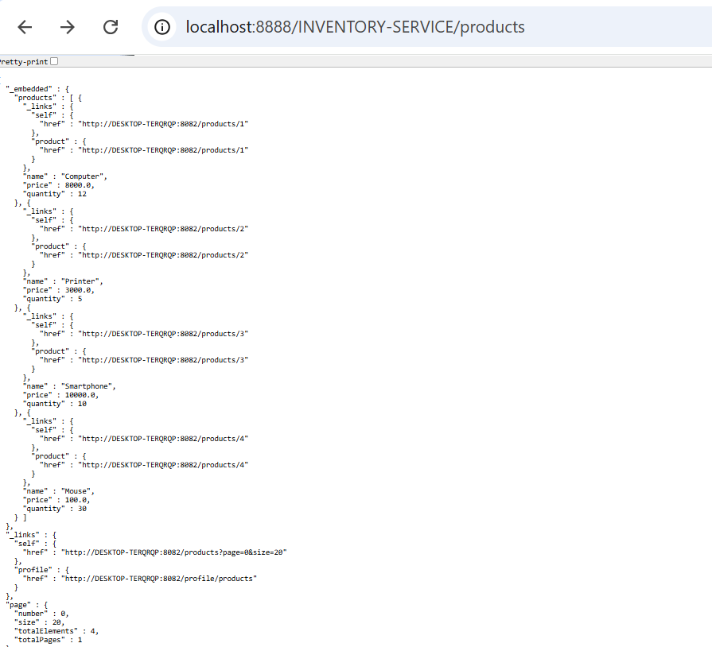

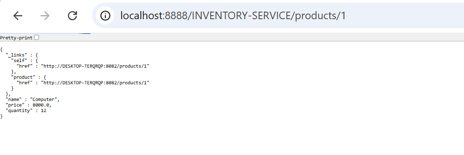

> **Stratégie recommandée :**
> - **Routage dynamique** pour les services enregistrés dans Eureka (microservices internes)
> - **Routage statique** pour les services externes non enregistrés (ex : OpenAI API, services tiers)

---

## 7. Microservice 5 — Billing Service avec OpenFeign

### 7.1 Contexte et objectif

Le Billing Service gère les factures. Chaque facture contient :
- Une référence à un **client** (géré par `customer-service`)
- Des lignes de facture avec des **produits** (gérés par `inventory-service`)

Il doit donc **communiquer** avec les deux autres services pour récupérer les informations complètes.

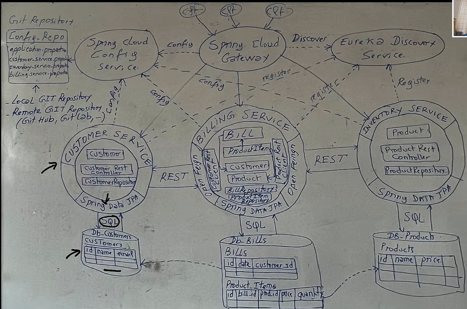

### 7.2 Méthodes de communication inter-services

Pour faire cette communication, il faut un framework qui crée un client REST et envoie des requêtes HTTP entre microservices.

| Outil | Type | Commentaire |
|---|---|---|
| `RestTemplate` | Synchrone, programmatique | Ancien, verbeux |
| `RestClient` | Synchrone, programmatique | Plus récent |
| `WebClient` | Asynchrone, réactif | Adapté au modèle non-bloquant |
| **`OpenFeign`** | **Déclaratif (interface)** | **Recommandé — simple, on ne crée qu'une interface** |

> **OpenFeign** est déclaratif : on écrit juste une interface avec les méthodes souhaitées. OpenFeign génère automatiquement le client HTTP qui envoie les requêtes. Pour réduire la latence, on peut utiliser l'**event sourcing avec Kafka** (communication asynchrone).

### 7.3 Création du module

On ajoute `billing-service` avec les mêmes dépendances que les autres microservices, **plus OpenFeign** :

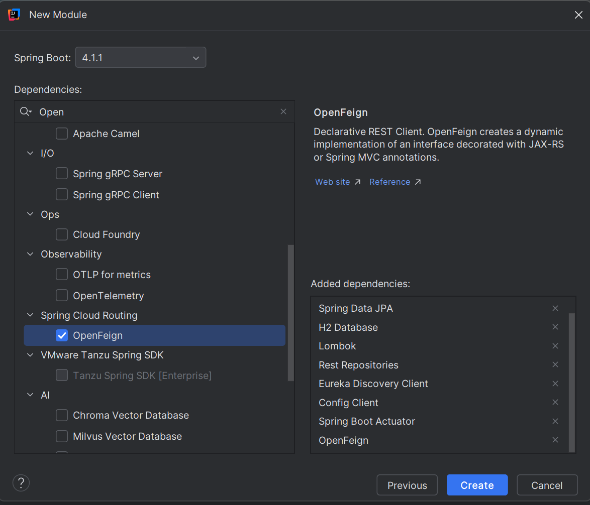

### 7.4 Entités JPA

**Bill.java — La facture**

```java
package net.tayebi.billingservice.entities;

import jakarta.persistence.*;
import lombok.*;
import java.util.ArrayList;
import java.util.Date;
import java.util.List;

@Entity
@NoArgsConstructor @AllArgsConstructor @Getter @Setter @Builder
public class Bill {
    @Id @GeneratedValue(strategy = GenerationType.IDENTITY)
    private Long id;
    private Date billingDate;
    private long customerId;              // ID du client (stocké localement)

    @OneToMany(mappedBy = "bill")
    private List<ProductItem> productItems = new ArrayList<>();

    // @Transient : pas stocké en BDD — rempli dynamiquement via OpenFeign
    @Transient
    private Customer customer;
}
```

**ProductItem.java — Les lignes de facture**

```java
package net.tayebi.billingservice.entities;

import jakarta.persistence.*;
import lombok.*;
import net.tayebi.billingservice.model.Product;

@Entity
@NoArgsConstructor @AllArgsConstructor @Getter @Setter @Builder
public class ProductItem {
    @Id @GeneratedValue
    private Long id;
    private long productId;              // ID du produit (stocké localement) — clé nécessaire
    private int quantity;
    private double price;

    @ManyToOne
    @JsonProperty(access = JsonProperty.Access.WRITE_ONLY)  // Évite la boucle JSON infinie
    private Bill bill;

    // @Transient : JPA ignore ce champ — rempli dynamiquement via OpenFeign
    @Transient
    private Product product;
}
```

> **`@Transient` :** Indique à JPA d'ignorer ce champ lors de la persistance. L'objet existe dans la classe Java pour transporter les données, mais il n'a pas de colonne correspondante en base de données.
>
> Pour communiquer avec la base locale → on utilise les repositories JPA.  
> Pour communiquer avec un autre microservice → on utilise REST ou OpenFeign.

### 7.5 Modèles (non-entités)

Ces classes représentent des données venant d'autres microservices. Ce ne sont **pas** des entités JPA — elles sont déclarées comme modèles car elles sont déjà gérées par les autres services.

**Customer.java (model)**

```java
package net.tayebi.billingservice.model;

import lombok.*;

@NoArgsConstructor @AllArgsConstructor @Getter @Setter @Builder
public class Customer {
    private String id;
    private String name;
    private String email;
}
```

**Product.java (model)**

```java
package net.tayebi.billingservice.model;

import lombok.*;

@NoArgsConstructor @AllArgsConstructor @Getter @Setter @Builder
public class Product {
    private Long id;
    private String name;
    private double price;
    private int quantity;
}
```

### 7.6 Repositories

```java
package net.tayebi.billingservice.repositories;

import net.tayebi.billingservice.entities.Bill;
import org.springframework.data.jpa.repository.JpaRepository;
import org.springframework.data.rest.core.annotation.RepositoryRestResource;

@RepositoryRestResource
public interface BillRepository extends JpaRepository<Bill, Long> {
}
```

```java
package net.tayebi.billingservice.repositories;

import net.tayebi.billingservice.entities.ProductItem;
import org.springframework.data.jpa.repository.JpaRepository;
import org.springframework.data.rest.core.annotation.RepositoryRestResource;
import java.util.List;

@RepositoryRestResource
public interface ProductItemRepository extends JpaRepository<ProductItem, Long> {
    List<ProductItem> findByBillId(Long billId);   // Méthode dérivée Spring Data
}
```

### 7.7 Clients OpenFeign — Communication inter-services

**CustomerServiceRestClient.java**

```java
package net.tayebi.billingservice.feign;

import net.tayebi.billingservice.model.Customer;
import org.springframework.cloud.openfeign.FeignClient;
import org.springframework.web.bind.annotation.GetMapping;
import org.springframework.web.bind.annotation.PathVariable;

// "customer-service" = nom exact du service dans Eureka
@FeignClient("customer-service")
public interface CustomerServiceRestClient {

 // OpenFeign envoie GET /customers/{id} au customer-service
 // Il passe par Eureka pour résoudre l'adresse IP, puis envoie la requête
 // La réponse JSON est désérialisée automatiquement en objet Customer
 @GetMapping("/customers/{id}")
 Customer findCustomerById(@PathVariable Long id);
}
```

**InventoryServiceRestClient.java**

```java
package net.tayebi.billingservice.feign;

import net.tayebi.billingservice.model.Product;
import org.springframework.cloud.openfeign.FeignClient;
import org.springframework.web.bind.annotation.GetMapping;
import org.springframework.web.bind.annotation.PathVariable;

@FeignClient("inventory-service")
public interface InventoryServiceRestClient {

    @GetMapping("/products/{id}")
    Product findProductById(@PathVariable Long id);
}
```

> **Fonctionnement d'OpenFeign :**
> 1. On appelle `customerServiceRestClient.findCustomerById(1L)` dans notre code Java
> 2. OpenFeign consulte Eureka : "où est `customer-service` ?"
> 3. Eureka retourne l'adresse IP + port
> 4. OpenFeign envoie automatiquement `GET http://ip:port/customers/1`
> 5. La réponse JSON est désérialisée en objet `Customer`
>
> OpenFeign est une **interface déclarative** : on déclare les méthodes, le framework gère tout le reste.

### 7.8 Activation d'OpenFeign dans la classe principale

```java
package net.tayebi.billingservice;

import org.springframework.boot.SpringApplication;
import org.springframework.boot.autoconfigure.SpringBootApplication;
import org.springframework.cloud.openfeign.EnableFeignClients;

@SpringBootApplication
@EnableFeignClients   // ← OBLIGATOIRE : active le scan des interfaces @FeignClient
                      // Sans ça, erreur "no implementation found for Feign interface"
public class BillingServiceApplication {

    public static void main(String[] args) {
        SpringApplication.run(BillingServiceApplication.class, args);
    }

    @Bean
    CommandLineRunner start(BillRepository billRepository, ProductItemRepository productItemRepository) {
        return args -> {
            List<Long> customersIds = List.of(1L, 2L, 3L);
            List<Long> productIds   = List.of(1L, 2L, 3L);

            customersIds.forEach(clientId -> {
                Bill bill = new Bill();
                bill.setBillingDate(new Date());
                bill.setCustomerId(clientId);
                billRepository.save(bill);

                productIds.forEach(productId -> {
                    ProductItem productItem = new ProductItem();
                    productItem.setPrice(1000 * Math.random() * 600);
                    productItem.setQuantity(1 + new Random().nextInt(20));
                    productItem.setProductId(productId);
                    productItem.setBill(bill);
                    productItemRepository.save(productItem);
                });
            });
        };
    }
}
```

### 7.9 Configuration

```properties
spring.application.name=billing-service
server.port=8083
spring.datasource.url=jdbc:h2:mem:billing-db
spring.h2.console.enabled=true
spring.cloud.config.enabled=false
spring.cloud.discovery.enabled=true   # ← true obligatoire pour OpenFeign via Eureka
```

### 7.10 Vérification en base H2

**Table BILL :**

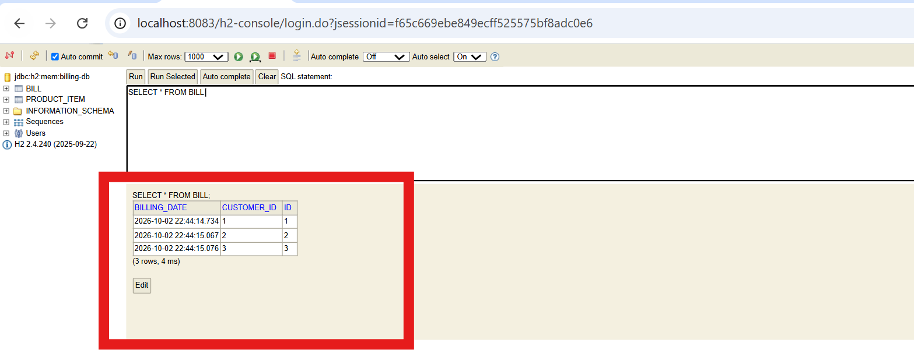

**Table PRODUCT_ITEM :**

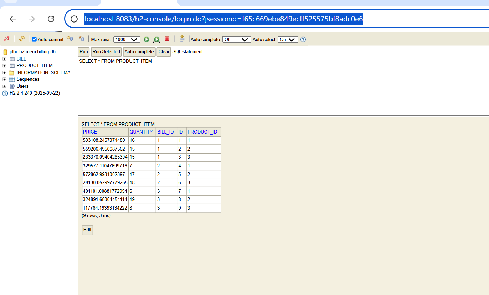

### 7.11 Tests des endpoints REST Spring Data REST

```
GET http://localhost:8083/bills
```

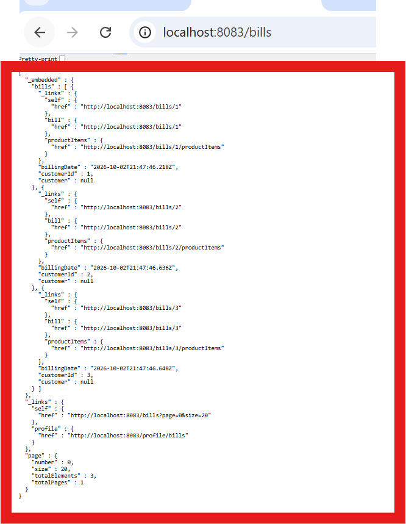

```
GET http://localhost:8083/productItems
```

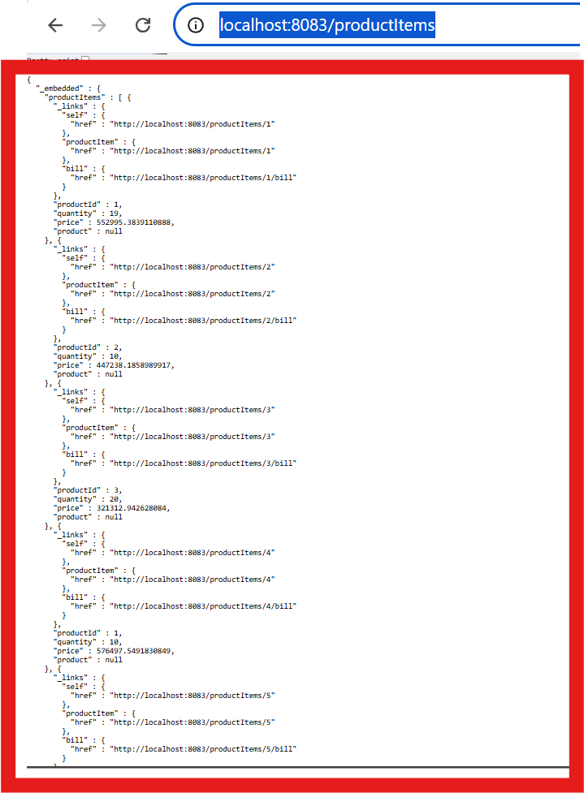

### 7.12 REST Controller avec OpenFeign — Facture complète

```java
package net.tayebi.billingservice.web;

import lombok.AllArgsConstructor;
import net.tayebi.billingservice.entities.Bill;
import net.tayebi.billingservice.feign.CustomerServiceRestClient;
import net.tayebi.billingservice.feign.InventoryServiceRestClient;
import net.tayebi.billingservice.repositories.BillRepository;
import net.tayebi.billingservice.repositories.ProductItemRepository;
import org.springframework.beans.factory.annotation.Autowired;
import org.springframework.web.bind.annotation.*;
import java.util.List;

@RestController
@RequestMapping("/api")
public class BillRestController {

    @Autowired private BillRepository billRepository;
    @Autowired private ProductItemRepository productItemRepository;
    @Autowired private CustomerServiceRestClient customerServiceRestClient;
    @Autowired private InventoryServiceRestClient inventoryServiceRestClient;

    // GET /api/bills → liste toutes les factures
    @GetMapping("/bills")
    public List<Bill> getBills() {
        return billRepository.findAll();
    }

    // GET /api/bills/{id} → facture complète avec client et produits enrichis
    @GetMapping("/bills/{id}")
    public Bill getBillById(@PathVariable Long id) {
        Bill bill = billRepository.findById(id).get();

        // 1. Appel OpenFeign → customer-service → récupère le client
        bill.setCustomer(customerServiceRestClient.findCustomerById(bill.getCustomerId()));

        // 2. Pour chaque ligne de facture, appel OpenFeign → inventory-service
        //    Récupère les détails du produit et les injecte dans la ligne
        bill.getProductItems().forEach(pi ->
            pi.setProduct(inventoryServiceRestClient.findProductById(pi.getProductId()))
        );

        return bill;
    }
}
```

**Problème rencontré — boucle infinie JSON :**  
Lors du test, la sérialisation JSON entrait en boucle infinie (Bill → ProductItems → Bill → ProductItems…).

**Solution :** Ajouter `@JsonProperty(access = JsonProperty.Access.WRITE_ONLY)` sur le champ `bill` dans `ProductItem` pour l'ignorer en lecture (sérialisation) tout en le gardant en écriture (désérialisation) :

```java
@ManyToOne
@JsonProperty(access = JsonProperty.Access.WRITE_ONLY)
private Bill bill;
```

### 7.13 Tests finaux

```
GET http://localhost:8083/api/bills
```

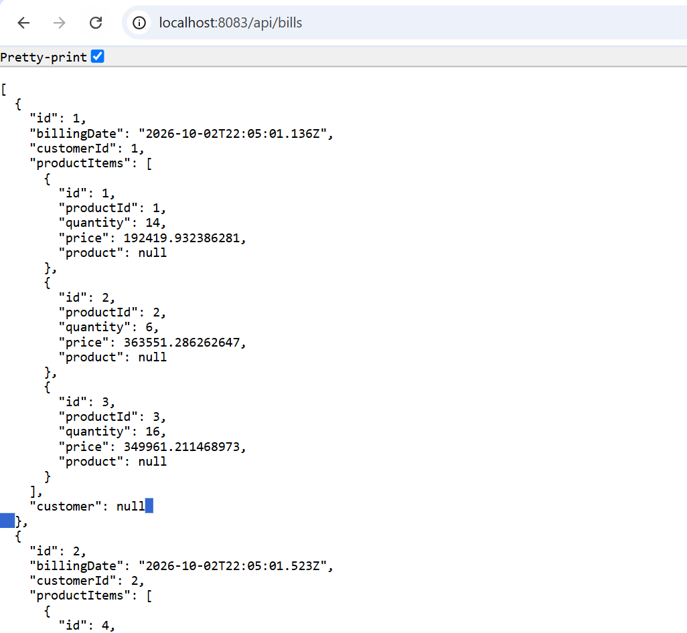

```
GET http://localhost:8083/api/bills/1
```

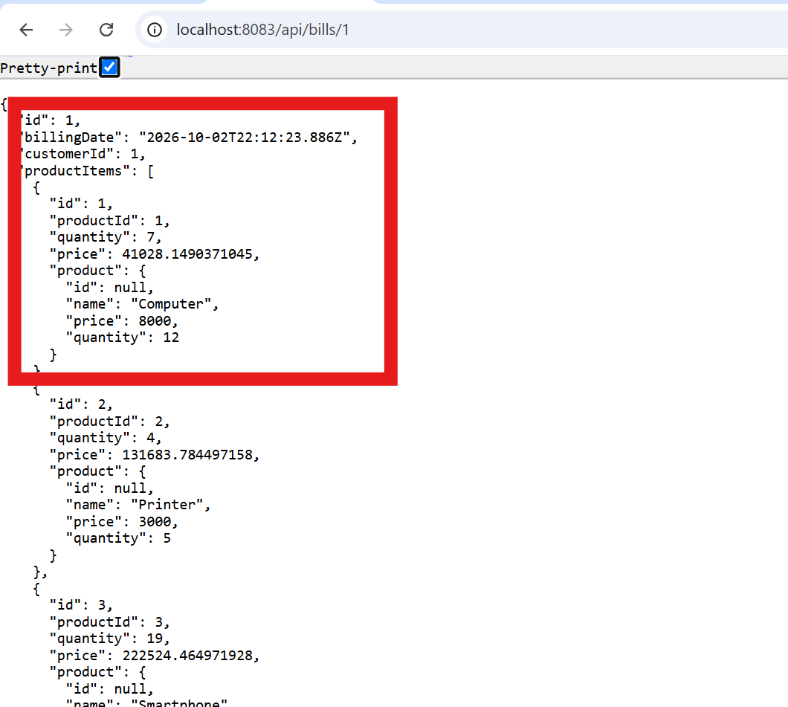

> **Résultat :** En une seule requête, on obtient une facture complète dont les données proviennent de **3 bases de données différentes** (`billing-db`, `customers-db`, `products-db`), grâce à OpenFeign qui fait les appels inter-services de manière transparente.

**Test via la Gateway :**

```
GET http://localhost:8888/BILLING-SERVICE/api/bills/1
```

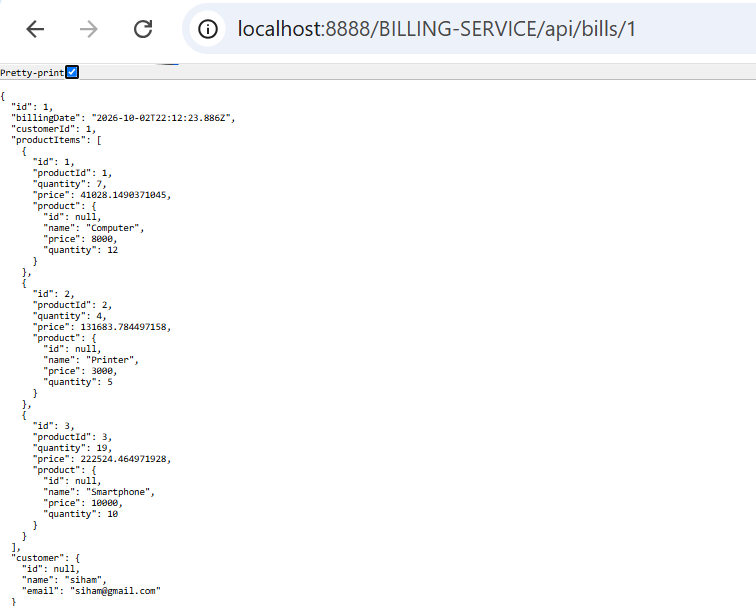

---

## 8. Résilience — Circuit Breaker Resilience4j

### 8.1 Le problème : défaillance en cascade

Si `customer-service` tombe en panne, toute requête vers `/api/bills/{id}` échoue, même si le billing-service lui-même fonctionne. Sans gestion, une panne dans un service peut provoquer une **défaillance en cascade** dans toute l'architecture.

```
GET http://localhost:8888/BILLING-SERVICE/api/bills/1
```

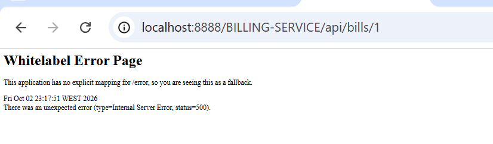

### 8.2 Solution — Pattern Circuit Breaker

Le **Circuit Breaker** (disjoncteur) isole les défaillances. Si un service répond en erreur, le circuit s'ouvre et on exécute une **méthode de fallback** (réponse par défaut) au lieu de propager l'erreur.

On ajoute la dépendance **Resilience4j** dans `billing-service`.

### 8.3 CustomerServiceRestClient avec Circuit Breaker

```java
package net.tayebi.billingservice.feign;

import io.github.resilience4j.circuitbreaker.annotation.CircuitBreaker;
import net.tayebi.billingservice.model.Customer;
import org.springframework.cloud.openfeign.FeignClient;
import org.springframework.web.bind.annotation.GetMapping;
import org.springframework.web.bind.annotation.PathVariable;

@FeignClient("customer-service")
public interface CustomerServiceRestClient {

    @GetMapping("/customers/{id}")
    @CircuitBreaker(
        name = "customer-service",              // Nom du circuit breaker
        fallbackMethod = "getDefaultCustomer"   // Méthode appelée si le service est en panne
    )
    Customer findCustomerById(@PathVariable Long id);

    // Méthode de fallback : si customer-service est en panne,
    // on ne génère pas d'exception — on retourne un client par défaut depuis le cache
    default Customer getDefaultCustomer(Long customerId, Exception exception) {
        Customer customer = new Customer();
        customer.setId(String.valueOf(customerId));
        customer.setName("Default Customer");
        customer.setEmail("default@email.com");
        return customer;
    }
}
```

**Test avec customer-service arrêté :**

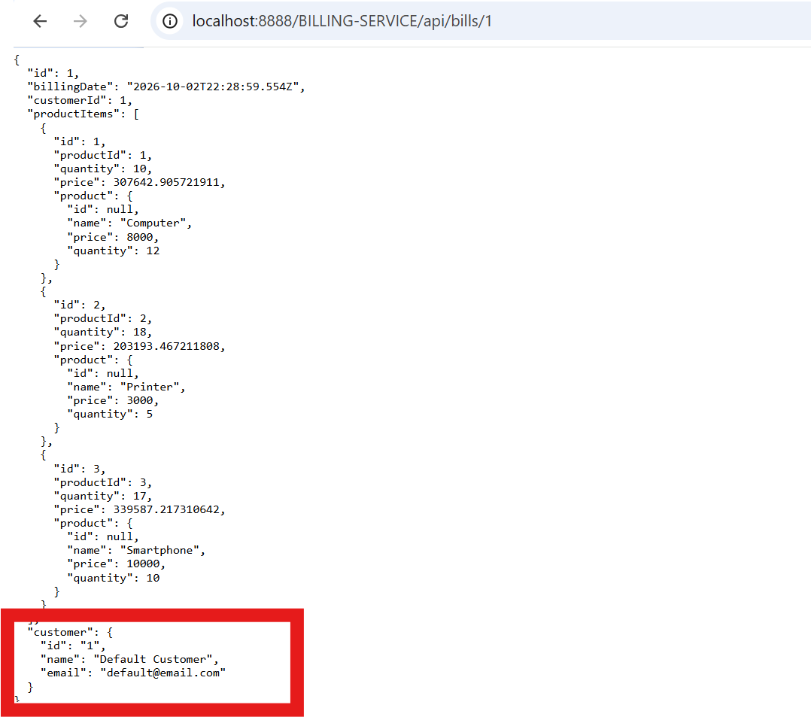

**Après redémarrage du customer-service, les vraies données reviennent :**

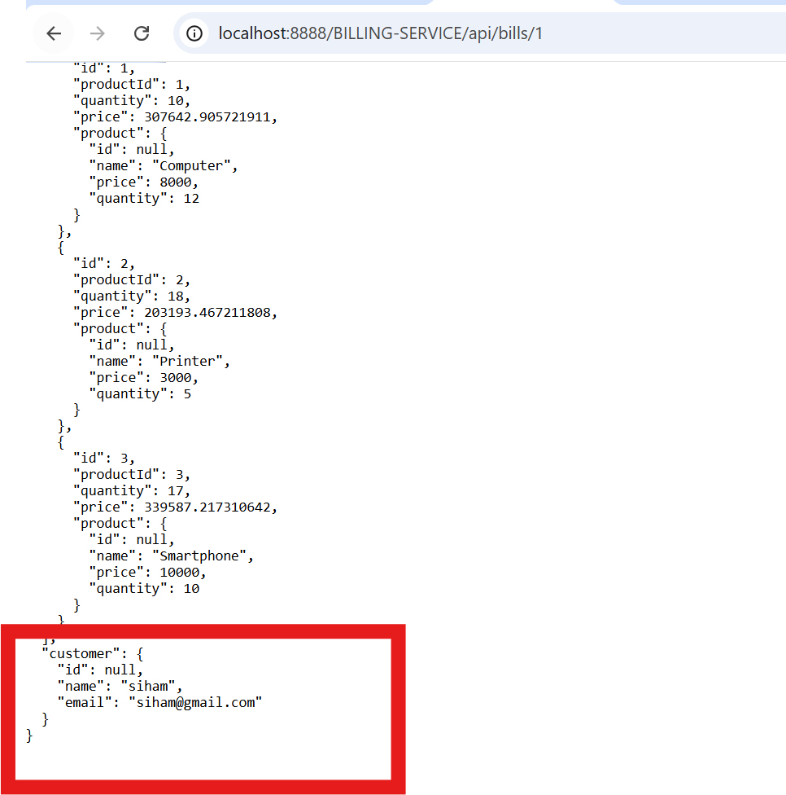

### 8.4 InventoryServiceRestClient avec Circuit Breaker

```java
package net.tayebi.billingservice.feign;

import io.github.resilience4j.circuitbreaker.annotation.CircuitBreaker;
import net.tayebi.billingservice.model.Product;
import org.springframework.cloud.openfeign.FeignClient;
import org.springframework.web.bind.annotation.GetMapping;
import org.springframework.web.bind.annotation.PathVariable;

@FeignClient("inventory-service")
public interface InventoryServiceRestClient {

    @GetMapping("/products/{id}")
    @CircuitBreaker(name = "inventory-service", fallbackMethod = "getDefaultProduct")
    Product findProductById(@PathVariable Long id);

    default Product getDefaultProduct(Long id, Exception exception) {
        Product product = new Product();
        product.setId(id);
        product.setName("Default Product");
        product.setPrice(-1);     // -1 indique un produit de fallback
        product.setQuantity(-1);
        return product;
    }
}
```

**Test avec inventory-service arrêté :**

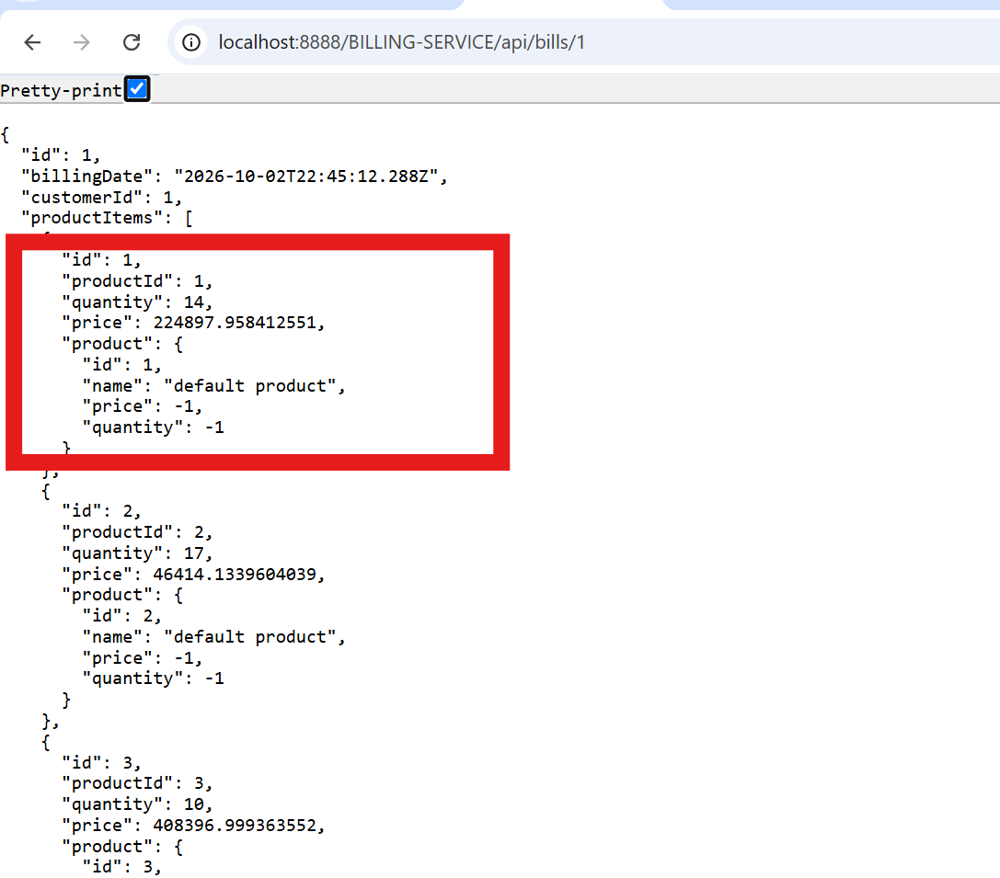

> **Avantage :** L'application reste fonctionnelle même en cas de panne partielle. L'utilisateur reçoit des données dégradées mais cohérentes, au lieu d'une erreur 500.

---

## 9. Microservice 6 — Config Service Spring Cloud Config

### 9.1 Problème — Configuration distribuée

Dans notre architecture, chaque microservice a son propre fichier `application.properties`. En production avec des dizaines de services, modifier une configuration nécessite de modifier chaque fichier et redémarrer chaque service — c'est ingérable.

**Solution :** Un **Config Service** centralisé qui :
- Stocke toutes les configurations dans un **dépôt Git** (versionné)
- Distribue les configurations aux microservices au démarrage
- Permet la **mise à jour à chaud** sans redémarrage
- Peut utiliser **Vault** pour stocker les secrets (mots de passe, clés API)

### 9.2 Structure du dépôt de configuration (config-repo)

```
config-repo/
├── application.properties         ← Config commune à TOUS les microservices
├── customer-service.properties    ← Config spécifique à customer-service
├── inventory-service.properties   ← Config spécifique à inventory-service
├── billing-service.properties     ← Config spécifique à billing-service
└── gateway-service.properties     ← Config spécifique à gateway-service
```

Au démarrage, chaque microservice envoie une requête au Config Service pour demander sa configuration. Il l'identifie par son **nom** (`spring.application.name`).

**Exemple — `application.properties` (config commune) :**
```properties
global.params.p1=999
global.params.p2=888
```

**Exemple — `customer-service.properties` :**
```properties
customer.params.x=11
customer.params.y=22
```

### 9.3 Création du module Config Service

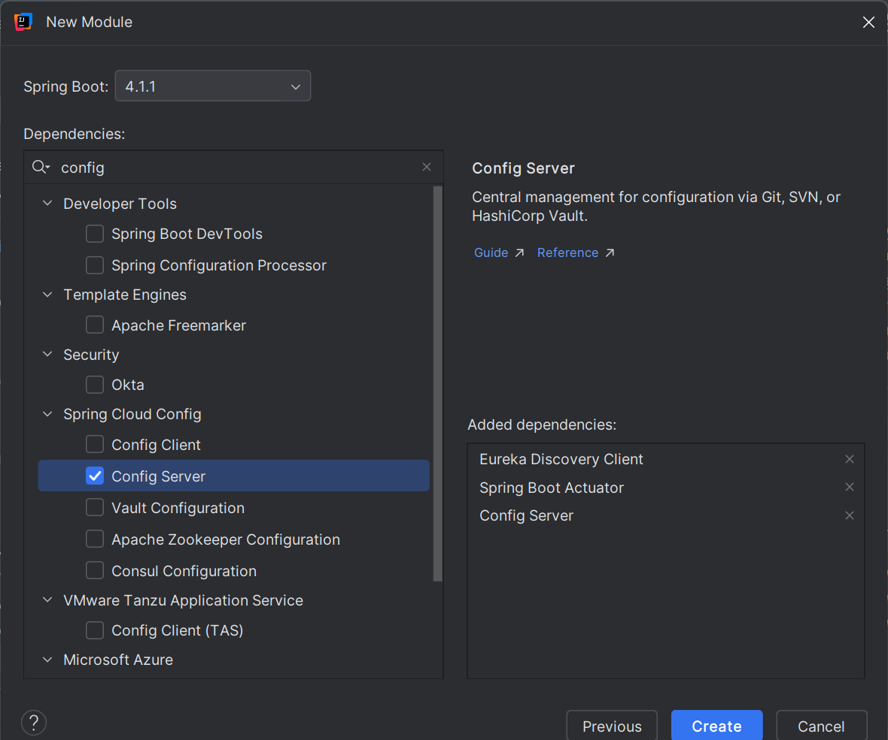

**Classe principale :**

```java
package net.tayebi.configservice;

import org.springframework.boot.SpringApplication;
import org.springframework.boot.autoconfigure.SpringBootApplication;
import org.springframework.cloud.config.server.EnableConfigServer;

@SpringBootApplication
@EnableConfigServer   // ← Active le serveur de configuration Spring Cloud
public class ConfigServiceApplication {
    public static void main(String[] args) {
        SpringApplication.run(ConfigServiceApplication.class, args);
    }
}
```

**Configuration :**

```properties
spring.application.name=config-service
server.port=9999

# Chemin local du dépôt Git de configuration
spring.cloud.config.server.git.uri=file://C:/Users/PC/IdeaProjects/ebank-ms/config-repo
```

### 9.4 Tests du Config Service

**Config commune (toutes les applications) :**

```
GET http://localhost:9999/application/default
```

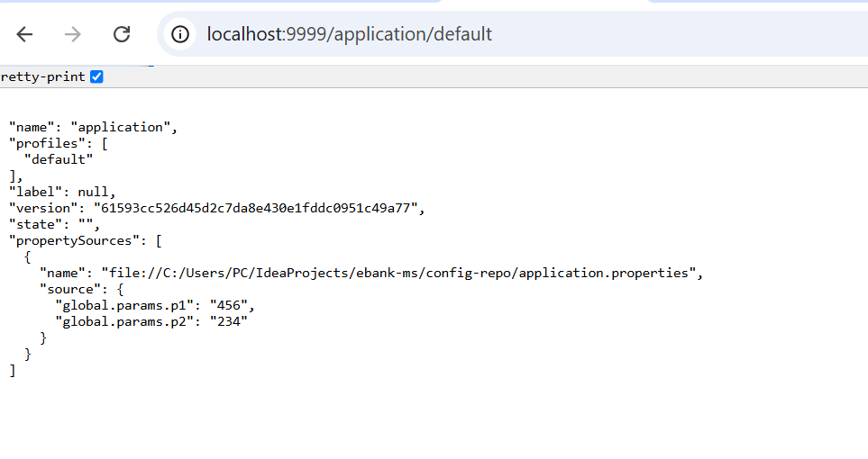

**Config spécifique à customer-service (profil default) :**

```
GET http://localhost:9999/customer-service/default
```

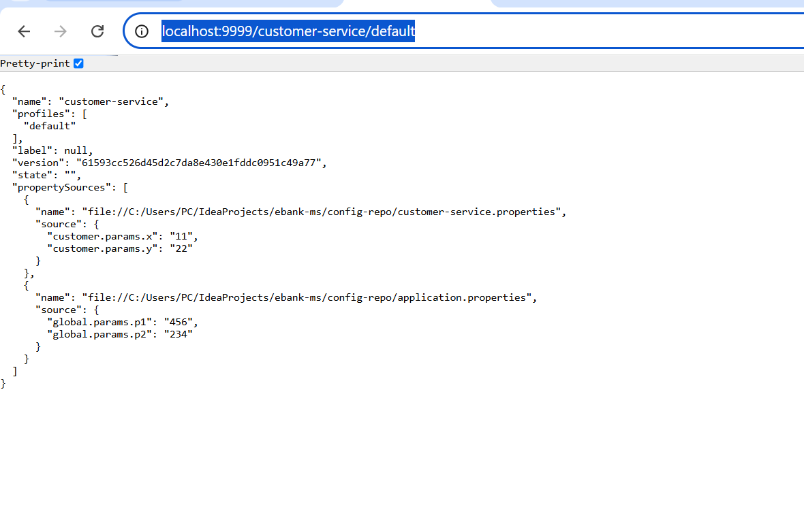

**Config customer-service pour le profil production :**

```
GET http://localhost:9999/customer-service/prod
```

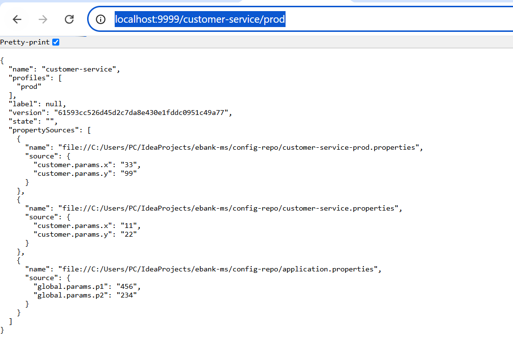

### 9.5 Modification de la configuration

On modifie `application.properties` dans le config-repo :

```properties
# Avant
global.params.p1=456
global.params.p2=234

# Après
global.params.p1=999
global.params.p2=888
```

On fait un `git commit`. Le Config Service retourne immédiatement les nouvelles valeurs :

```
GET http://localhost:9999/customer-service/prod
```

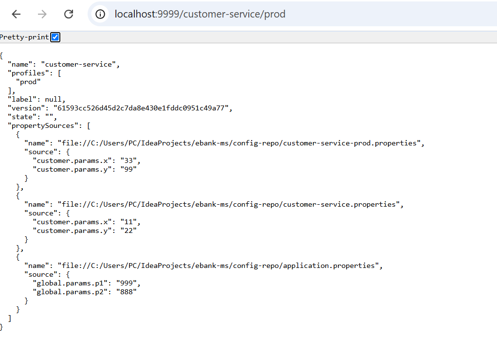

### 9.6 Consommation de la configuration dans customer-service

On configure `customer-service` pour importer sa configuration depuis le Config Service :

```properties
spring.config.import=optional:configserver:http://localhost:9999
```

**Méthode 1 — Via `@Value` :**

```java
package net.tayebi.customerservice.config;

import org.springframework.beans.factory.annotation.Value;
import org.springframework.cloud.context.config.annotation.RefreshScope;
import org.springframework.web.bind.annotation.GetMapping;
import org.springframework.web.bind.annotation.RestController;
import java.util.Map;

@RestController
@RefreshScope   // ← Permet la mise à jour à chaud sans redémarrage
public class ConfigTestRestController {

    @Value("${global.params.p1}")   // ← Injecte la valeur depuis le Config Service
    private String p1;

    @Value("${global.params.p2}")
    private String p2;

    @GetMapping("/testConfig1")
    public Map<String, String> configTest() {
        return Map.of("p1", p1, "p2", p2);
    }
}
```

```
GET http://localhost:8081/testConfig1
```

Résultat :
```json
{ "p1": "999", "p2": "888" }
```

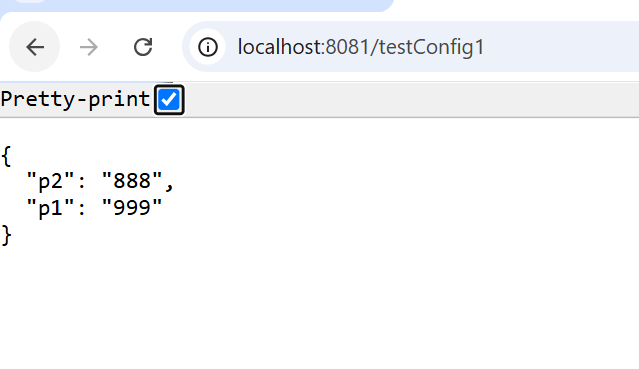

**Méthode 2 — Via `@ConfigurationProperties` (record Java) :**

```java
package net.tayebi.customerservice.config;

import org.springframework.boot.context.properties.ConfigurationProperties;

// Record Java : classe immuable avec getters automatiques
// Lit le préfixe "customer.params" depuis la configuration
@ConfigurationProperties(prefix = "customer.params")
public record CustomerConfigParams(int x, int y) {}
```

Dans la classe principale, on active cette configuration :

```java
@SpringBootApplication
@EnableConfigurationProperties(CustomerConfigParams.class)   // ← Active la config typée
public class CustomerServiceApplication { ... }
```

```java
@RestController
@RefreshScope
public class ConfigTestRestController {

    @Autowired
    private CustomerConfigParams customerConfigParams;

    @GetMapping("/testConfig2")
    public CustomerConfigParams configTest2() {
        return customerConfigParams;
    }
}
```

```
GET http://localhost:8081/testConfig2
```

Résultat :
```json
{ "x": 11, "y": 22 }
```

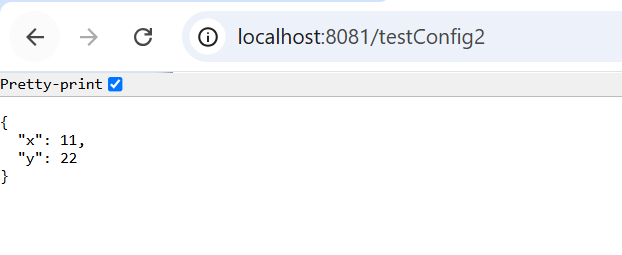

---

## 10. Refresh à chaud de la configuration

### 10.1 Principe

L'annotation `@RefreshScope` permet à un bean Spring de **recharger sa configuration sans redémarrer** le service. Sans cette annotation, les valeurs `@Value` restent figées à celles du démarrage.

**Flux de mise à jour à chaud :**

```
1. Développeur modifie la configuration dans config-repo
         ↓
2. git commit (versionner les changements)
         ↓
3. POST http://microservice:port/actuator/refresh
         ↓
4. Le microservice contacte le Config Service
         ↓
5. Le Config Service retourne les nouvelles valeurs
         ↓
6. Les beans @RefreshScope sont réinstanciés avec la nouvelle config
         ↓
7. Aucun redémarrage du service nécessaire ✅
```

### 10.2 Activation d'Actuator dans customer-service

```properties
# On expose uniquement les endpoints utiles
management.endpoints.web.exposure.include=health,refresh
```

### 10.3 Démo — Mise à jour sans redémarrage

**Étape 1 — Modifier la configuration (version 2) :**

```properties
global.params.p1=7777
global.params.p2=9999
```

Commit Git :

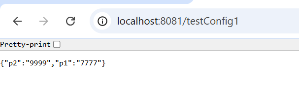

**Étape 2 — Modifier encore (version 3) :**

```properties
global.params.p1=0102
global.params.p2=0340
```

Commit Git :

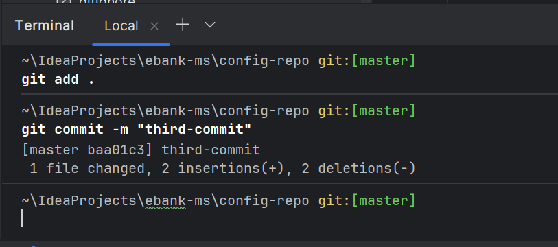

**Étape 3 — Envoyer la requête de refresh (sans redémarrer le service) :**

En utilisant un client HTTP (IntelliJ HTTP Client, Postman, curl…) :

```http
POST http://localhost:8081/actuator/refresh
Accept: application/json
```

Réponse :
```json
["config.client.version"]
```

```
HTTP/1.1 200 OK
Response code: 200; Time: 447ms
```

**Étape 4 — Vérifier la nouvelle valeur :**

```
GET http://localhost:8081/testConfig1
```

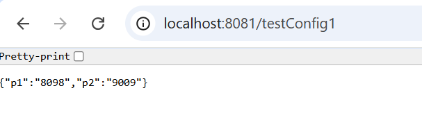

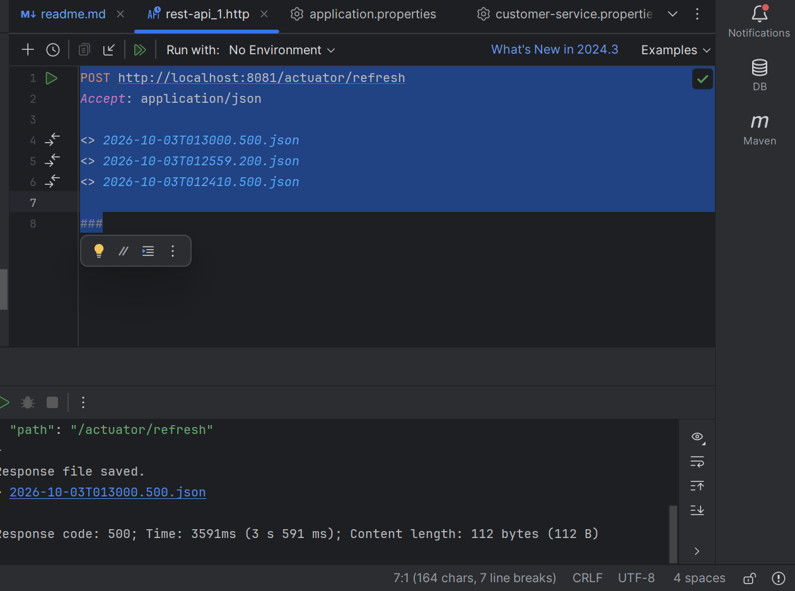

### 10.4 Connexion au dépôt GitHub distant

Pour un environnement de production, on versionne le config-repo sur GitHub. Il suffit de remplacer le chemin local par l'URL GitHub dans le Config Service :

```properties
# Avant (local)
spring.cloud.config.server.git.uri=file://C:/Users/PC/IdeaProjects/ebank-ms/config-repo

# Après (GitHub — plus adapté à la production)
spring.cloud.config.server.git.uri=https://github.com/siham-tayebi-pp/3-BDCCIII-tp2-SSD-E-Bank-Ms
```

Après redémarrage du Config Service, il lit la configuration directement depuis GitHub :

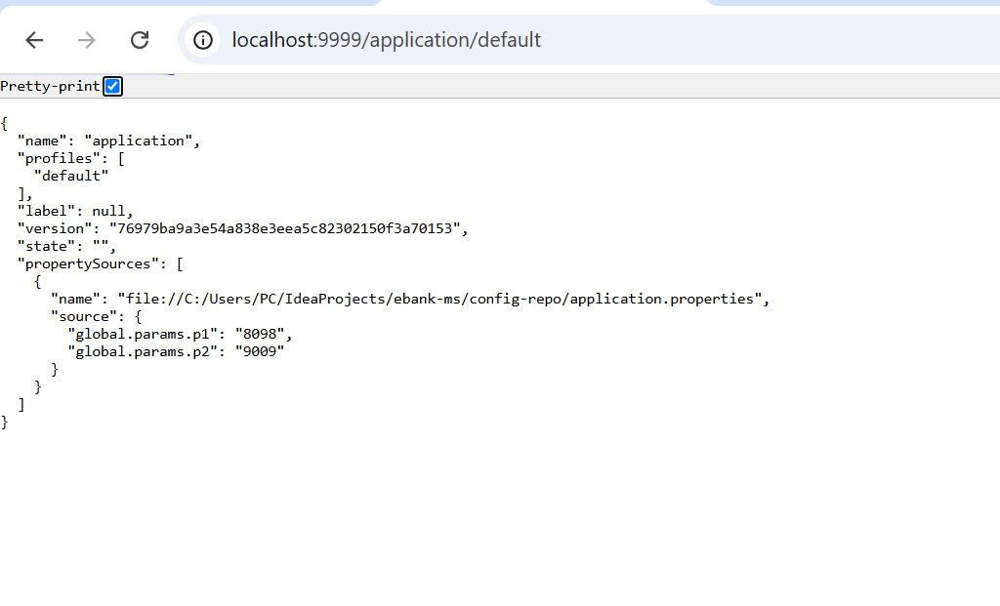

### 10.5 Transfert des configs locales vers le Config Service

On transfère les configurations de chaque microservice vers le dépôt Git du Config Service, et on remplace les `application.properties` locaux par une simple ligne d'import :

```properties
# Dans chaque microservice — remplace tout le contenu local par :
spring.config.import=optional:configserver:http://localhost:9999
```

---

## 11. Résultat final — Tous les services dans Eureka

Après configuration complète de tous les microservices, l'interface Eureka montre tous les services enregistrés :

```
http://localhost:8761/
```

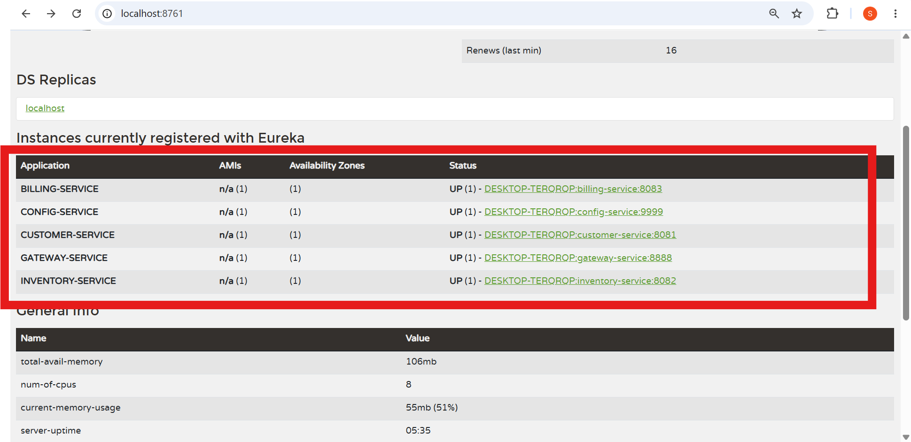

**Tests finaux via la Gateway :**

```
GET http://localhost:8888/BILLING-SERVICE/api/bills/1
```

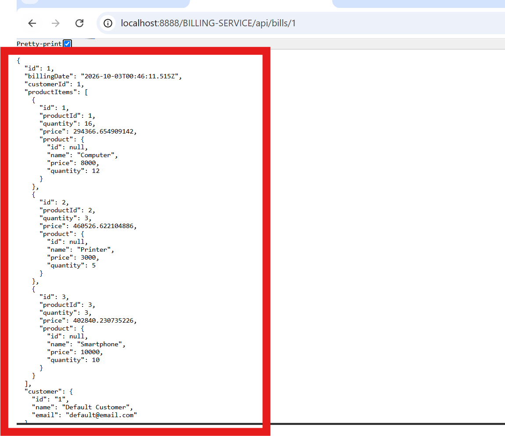

```
GET http://localhost:8888/CUSTOMER-SERVICE/customers/1
```

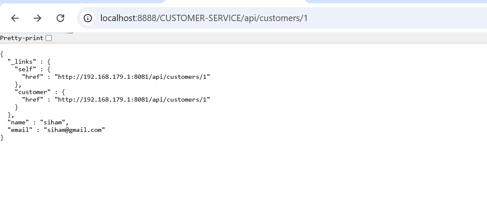

```
GET http://localhost:8888/INVENTORY-SERVICE/products/1
```

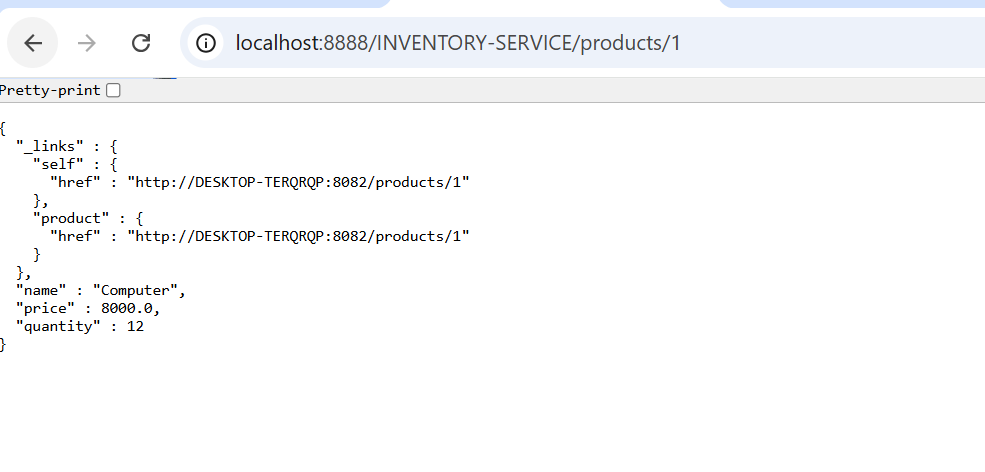

---

## 12. Conclusion

### 12.1 Bilan des microservices développés

| Service | Port | Rôle | Technologies clés |
|---|---|---|---|
| **customer-service** | 8081 | Gestion des clients | Spring Data REST, H2, Eureka Client |
| **inventory-service** | 8082 | Gestion des produits | Spring Data REST, H2, Actuator, Eureka Client |
| **billing-service** | 8083 | Gestion des factures | OpenFeign, Resilience4j, Eureka Client |
| **gateway-service** | 8888 | Routage + load balancing | Spring Cloud Gateway (Reactive), Eureka Client |
| **discovery-service** | 8761 | Registre des services | Eureka Server (Netflix) |
| **config-service** | 9999 | Configuration centralisée | Spring Cloud Config Server, Git |

### 12.2 Compétences acquises

| Compétence | Détail |
|---|---|
| Architecture microservices | Discovery, Gateway, Config, Circuit Breaker |
| Spring Data REST | Exposition automatique CRUD avec HATEOAS |
| Spring Cloud Gateway | Routage statique, dynamique, load balancing |
| Eureka Discovery | Enregistrement et découverte automatique des services |
| OpenFeign | Communication inter-services déclarative |
| Resilience4j | Tolérance aux pannes avec Circuit Breaker et fallback |
| Spring Cloud Config | Configuration centralisée versionnée avec Git |
| Actuator + @RefreshScope | Monitoring et rechargement à chaud de la configuration |

### 12.3 Points clés à retenir

1. **`@RepositoryRestResource`** crée un CRUD REST complet automatiquement — pratique pour aller vite sans couche service, mais limité aux opérations CRUD simples

2. **`lb://SERVICE-NAME`** dans l'URI de la Gateway active le load balancing via Eureka

3. **`@EnableFeignClients`** est obligatoire dans la classe principale pour activer les interfaces OpenFeign

4. **`@Transient`** permet de transporter des données d'autres microservices dans une entité JPA sans les persister en base

5. **`@CircuitBreaker` + fallback** rend l'architecture tolérante aux pannes — les services dégradent gracieusement

6. **`@RefreshScope`** permet la mise à jour de la configuration sans redémarrage des services

7. **Git + Config Service** : toujours versionner les configurations — cela permet le rollback et l'historique des changements

### 12.4 Prochaines étapes

```
✅ Réalisé dans ce TP :
   Customer Service
   Inventory Service
   Gateway Service (routage statique + dynamique)
   Discovery Service (Eureka)
   Billing Service + OpenFeign
   Circuit Breaker (Resilience4j)
   Config Service (Spring Cloud Config + Git)

🔄 À réaliser apres :
   Client Angular (Partie 9 du TP)
   Sécurité avec Keycloak (OAuth2 + OIDC)
   Containerisation avec Docker + Docker Compose
   Communication asynchrone avec Kafka
   Orchestration avec Kubernetes
```

---

*Compte rendu rédigé dans le cadre du module Architecture des Systèmes Distribués — ENSET Mohammedia, Université Hassan II, Filière BDCC III — Octobre 2026*